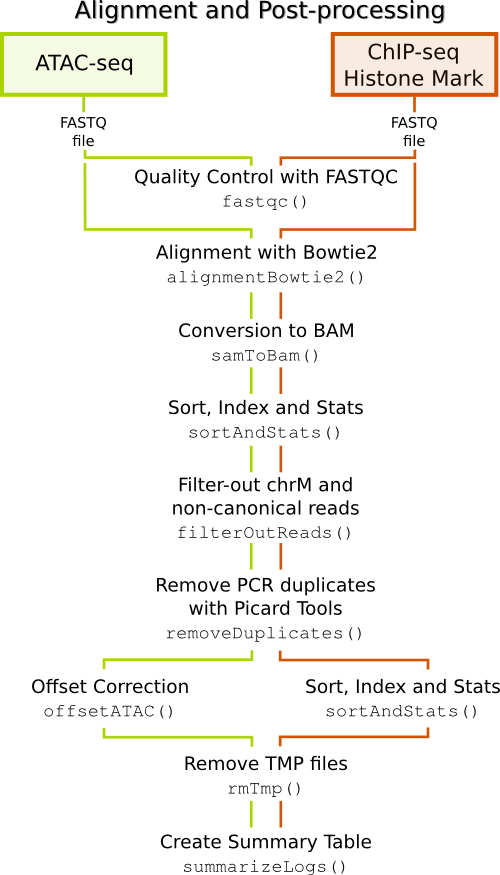

# pipelineNGS
`pipelineNGS` is a package for constructiong NGS analysis pipelines in R. It uses
predifined functions to make calls to different programs for performing the different 
steps in the processing and analysis of high-throughput data.

## Getting started
### Programs you need to have installed and included in your path:
- [FastQC](https://www.bioinformatics.babraham.ac.uk/projects/fastqc/)
- [bedtools](http://bedtools.readthedocs.io/en/latest/)
- [bowtie2](http://bowtie-bio.sourceforge.net/bowtie2/index.shtml)
- [TopHat2](https://ccb.jhu.edu/software/tophat/index.shtml)
- [Samtools](http://www.htslib.org/)
- [Picard Tools](https://broadinstitute.github.io/picard/) (*)Has to be installed, no need to be in the path.
- [MACS2](https://github.com/taoliu/MACS)

### Files you need to have in your local machine:
- Chromosome sizes (`gen_sizes`). Default value: `"~/data/hg19.len"`
- ENCODE Blacklist (`blacklist`). Default value: `"~/data/consensusBlacklist.bed"`

## Installing pipelineNGS in your local machine
Open your R session and type the following:
```r
devtools::install_git ("git@dogbert.imppc.local:mramos/pipelineNGS.git")
library(pipelineNGS)
```

## Overview
In the following images you can observe the general pipelina that is followed for the different steps of the analysis.
 