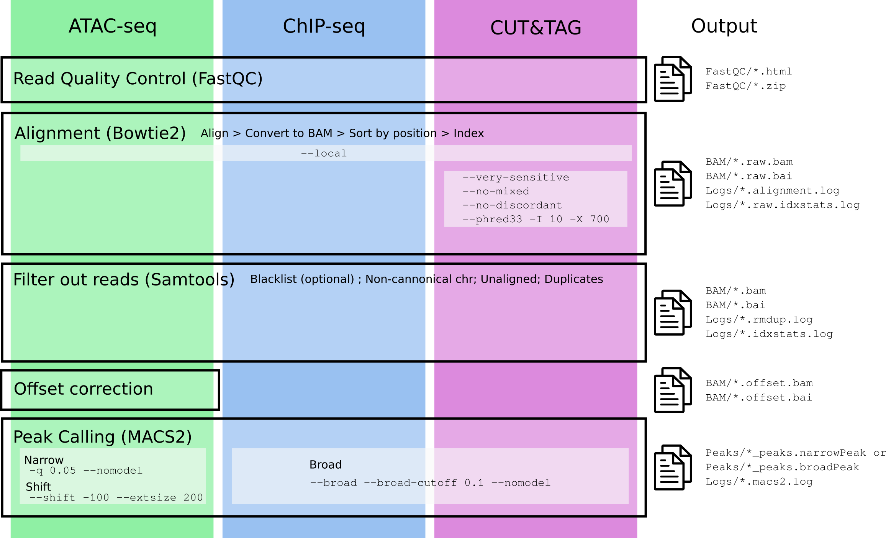

# pipelineNGS

`pipelineNGS` is a package for processing epigenomic high-throughput data, specifically histone mark ChIP-seq and ATAC-seq.

## Getting started

### Programs you need to have installed and included in your path:

As this package is a wrapper for some command line tools, you need to have this programs in your `$PATH`. If they are not in your `$PATH`, you can also provide the path to the binary files using the appropriate arguments.

-   [FastQC](https://www.bioinformatics.babraham.ac.uk/projects/fastqc/)
-   [bowtie2](http://bowtie-bio.sourceforge.net/bowtie2/index.shtml)
-   [Samtools](http://www.htslib.org/)
-   [MACS2](https://github.com/taoliu/MACS)

### Files you need to have in your local machine:

Additionally, you will need to download reference files to perform the different steps in the pre-processing pipeline:

-   Reference genome indexed with Bowtie2. See more information [here](http://bowtie-bio.sourceforge.net/bowtie2/manual.shtml#indexing-a-reference-genome). You can download the fasta files for the different genome builds from the [UCSC download site](https://hgdownload.soe.ucsc.edu/downloads.html#human).
-   Chromosome sizes (`gen_sizes`). You can download this file also from the UCSC: [hg38](https://hgdownload.cse.ucsc.edu/goldenPath/hg38/bigZips/hg38.chrom.sizes) or [hg19](https://hgdownload.cse.ucsc.edu/goldenPath/hg19/bigZips/hg19.chrom.sizes). Only necessary for ATAC-seq offset correction.
-   ENCODE Blacklist (`blacklist`). They can be downloaded from [here](https://sites.google.com/site/anshulkundaje/projects/blacklists).

## Installing pipelineNGS in your local machine

Open your R session, install the `devtools` package if it is not already in your machine and type the following:

    # Install pipelineNGS package
    devtools::install_github("mireia-bioinfo/pipelineNGS")

    # Load pipelineNGS package
    library(pipelineNGS)

## Pipeline Overview

In this package we currently have implemented the pipelines for analyzing the following experiments:

-   ATAC-seq (`ATAC`).
-   ChIP-seq for histone marks (`CHIP`).
-   CUTandTAG for histone marks (`CT`).
-   CUTandRUN for transcription factors (`CR`).

In the following figure you can see a description of the steps needed for the analysis of each type of experiment, with specific arguments (if any) used in the different steps.

Here is an example on how to run a ChIP-seq analysis with single-end data.

    ## General parameters
    index <- "/vault/refs/indexes/hg38"
    blacklist <- "/vault/refs/Blacklist/lists/hg38-blacklist.v2.bed"

    ## Example Single End ##
    fastq_files <- c("fastq/sample1_L1.fastq.gz", "fastq/sample1_L2.fastq.gz",
                     "fastq/sample1_L3.fastq.gz", "fastq/sample2_L2.fastq.gz",
                     "fastq/sample3_L1.fastq.gz", "fastq/sample3_L3.fastq.gz")

    ## Convert to list to use as input for process_epigenome()
    # Create one list element for each simple
    names <- sapply(strsplit(basename(fastq_files), "_"), function(x) x[1])
    fastq_input <- split(fastq_files, names)
    fastq_input

    ## Using the files described in the previous chunk:
    process_epigenome(fastq_files=fastq_input,
                      out_name=names(fastq_input),
                      run_fastqc=TRUE,
                      seq_type="CT",
                      type="PE",
                      index=index,
                      blacklist=blacklist,
                      cores=6)
